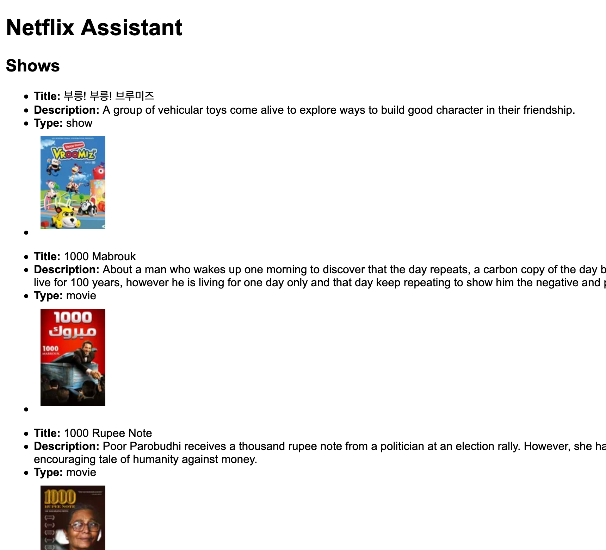

# Netflix Assistant 📺 👀 🌐
> A tool to help search and filter shows and movies on Netflix using the ReelGood API.

[ReelGood](https://reelgood.com) is a site which provides listing of TV shows and movies across many online services, including [Netflix](netflix.com/).

ReelGood has a great GUI on their website which is easy to navigate and they also use an API as part of this. I wanted to build my own show guide reports and recommendations list, so I pull data from their API with client-side JS and render it on a website.


## Notice

Note: This project no longer works on remote environments such Netlify due to CORS errors which were not present on initial development. The error happens despite setting `Access-Control-Allow-Origin` header in [netlify.toml](netlify.toml).

But, this app still works as a local app on localhost. 😄

This can also be rebuilt as a server-side app to avoid the CORS errors in the browser


## Sample




## Setup and run

### Local

Clone the repo.

```sh
$ git clone git@github.com:MichaelCurrin/netflix-assistant.git
```

Start a web server in the root directory.

Use VS Code Live server (auto reloads).

Or the command-line. e.g.

```sh
python3 -m http.server
```

Open the browser

- https://localhost:8000

### Remote

This repo can be deployed on Netlify. The CORS header must be set for API requests and this is not possible on Github Pages.

## Source of data

On ReelGood's website there is a view of TV shows and movies available to stream on Netflix.

- https://reelgood.com/source/netflix

The page supports filter parameters, ordering options and display format options.

The show data is retrieved from the ReelGood API.

- https://api.reelgood.com/v2/

This is done upon initial page load, when you apply filtering/sorting and also when you click _Load More_ at the bottom of the page.

The API is free to use and on their FAQ page they provide details for requesting API access. I found that without having to e-mail them that the API is easy to access. I have not found documentation for it yet, so I compare GUI choice I make with the API requests which are made and infer how the fields on the API requests work and what the response fields mean.


## License

Released under [MIT](/LICENSE).
